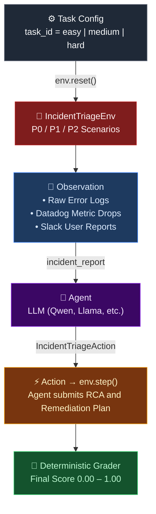

[](https://github.com/Harikishanth/Incident-Triage-Environment/actions/workflows/ci.yml)
[](https://github.com/Harikishanth/Incident-Triage-Environment/actions/workflows/docker.yml)

> [!NOTE]
> This is a verified Phase 2 deep-validation submission for the **Meta × HuggingFace × Scaler OpenEnv Hackathon 2026**.

> [!TIP]
> A live deployed version of this environment is available at: **https://dardrax-incident-triage-env.hf.space**

# 🚨 SRE Incident Triage Environment

A zero-LLM deterministic OpenEnv reinforcement learning environment evaluating the root-cause analysis capabilities of AI agents against real-world production outages. 

Production incidents cost millions in downtime. This environment tests whether an LLM can simulate a Staff Site Reliability Engineer (SRE): reading raw failure logs, filtering out downstream system symptoms, identifying the root cause, and synthesizing a prioritized step-by-step remediation plan.

## Quick Start

The simplest way to interact with the environment via python:

```python
import asyncio
from client import IncidentTriageEnv
from models import IncidentTriageAction

async def main():
    try:
        # Connect to the live HuggingFace Space
        env = await IncidentTriageEnv(base_url="https://dardrax-incident-triage-env.hf.space")

        # Reset the environment with a specific scenario tier
        result = await env.reset(task_id="medium")
        obs = result.observation
        
        print("====== INCIDENT REPORT ======")
        print(obs.incident_report)

        # Step — submit the agent's analysis 
        action = IncidentTriageAction(
            response="The root cause is an expired mutual TLS certificate. "
                     "First, manually rotate the cert. Second, restart the ingress pods."
        )
        result = await env.step(action)
        
        print(f"\nScore: {result.reward:.2f}")
        print(f"Feedback: {result.observation.feedback}")

    finally:
        await env.close()

asyncio.run(main())
```

---

## Agent Loop Architecture



---

## Tasks & Scenarios

The environment evaluates agents across 3 distinct difficulty tiers, with scenarios rotating dynamically per episode reset to prevent hard-coding.

| Task ID | Difficulty | Active Challenge | Core Competency Evaluated |
|---------|------------|------------------|---------------------------|
| `easy` | 🟢 P2 Incident | Single-system failure | Identifying explicit failures from clear trace logs. |
| `medium` | 🟡 P1 Incident | Cascading failure | Distinguishing the origin root cause from misleading downstream red-herrings across 3 separate log domains. |
| `hard` | 🔴 P0 Outage | Catastrophic crash | Synthesizing a strict, order-dependent 3-step disaster recovery action plan. |

---

## Action & Observation Spaces

### Action: `IncidentTriageAction`

| Field | Type | Description |
|-------|------|-------------|
| `response` | `str` | Agent's free-text analysis of the incident report. |

### Observation: `IncidentTriageObservation`

| Field | Type | Description |
|-------|------|-------------|
| `incident_report` | `str` | Full incident diagnostic packet containing logs, metrics, and charts. |
| `task_id` | `str` | Current difficulty tier being evaluated. |
| `feedback` | `str` | Textual feedback from the deterministic evaluator regarding missing keywords or incorrect scoping. |
| `done` | `bool` | Episode completion flag. |
| `reward` | `float` | Normalized reward score (`0.00` – `1.00`). |

---

## Reward Evaluation (Deterministic Heuristic Graders)

To ensuring absolute zero-LLM reproducibility, fairness, and speed across millions of inference runs, all grading is performed via hardened regex and deductive heuristics (see `server/graders.py`). 

Rewards are clipped strictly to `[0.01, 0.99]` to maintain OpenEnv strict boundary validation compliance. 

- **Easy Tier Strategy**: Validates against root cause extraction and implements **negation filtering** (e.g. failing responses containing `"not a connection pool issue"`). 
- **Medium Tier Strategy**: Fractional credit allocation: `50%` Root Cause Isolation, `30%` Red-Herring Dismissal, `20%` Symptom Tracking.
- **Hard Tier Strategy**: Fractional ordered credit allocation. Penalizes out-of-order action steps (e.g. diagnosing before rolling back).

---

## Baseline Inference Scores

Evaluation executed via `inference.py` using `Qwen/Qwen2.5-72B-Instruct` operating strictly at `TEMPERATURE=0.0`. 

| Tier | Task | Max Steps | Mean Score | Max |
|---|---|---|---|---|
| **Easy** | `easy` | 1 | 0.95 | 0.95 |
| **Medium** | `medium` | 1 | 0.50 | 0.80 |
| **Hard** | `hard` | 1 | 0.40 | 0.75 |
| **OVERALL** | — | — | **0.62** | **0.83** |

*Note: The inference baseline runs each task natively in isolated `[START]...[END]` loop blocks as required by the OpenEnv Phase 2 strict stdout protocols.*

```bash
# Run the automated inference loop on all tasks
uv run python inference.py

# Evaluate a specific tier
TASK_NAME=hard uv run python inference.py
```

---

## Deployment & Setup

### Local Run

```bash
git clone https://github.com/Harikishanth/Incident-Triage-Environment.git
cd Incident-Triage-Environment
uv sync
uvicorn server.app:app --reload --host 0.0.0.0 --port 8000
```

### Docker

```bash
docker build -t incident_triage_env:latest .
docker run -p 8000:8000 incident_triage_env:latest
```

### Hugging Face Space (OpenEnv Push)

```bash
openenv push --repo-id DarDrax/incident-triage-env
```
The deployed space automatically binds to HuggingFace's exposed infrastructure using port 8000 and natively provisions the OpenEnv Web UI, WebSocket (`/ws`), and automatic `/tasks` endpoints.

---

## Citation

```bibtex
@software{incidenttriageenv2026,
  title   = {Incident Triage Environment: Evaluating Foundation Models on SRE Root Cause Analysis},
  author  = {Tech Tridents (DarDrax)},
  year    = {2026},
  url     = {https://huggingface.co/spaces/DarDrax/incident-triage-env},
  note    = {Deterministic text-based RL environment for production incident resolution}
}
```
